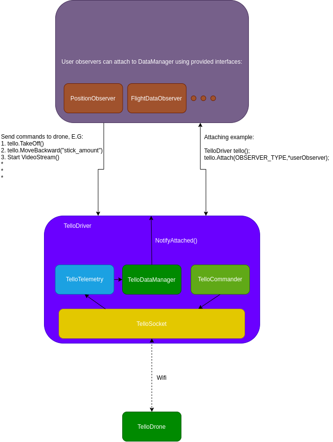

# tello_driver (cpp)

A **cpp** tello_driver for the DJI tello drone, that truly supports the **unofficial** SDK.
Meant to be included as a library, to other projects. See *[examples](examples)*.



## Implemented Capabilities from TelloPy

Not all TelloPy capabilities were implemented.

### Message receiving

- [x] Parsing LOG_HEADER_MSG  
- [x] Parsing LOG_DATA_MSG  
- [ ] Parsing LOG_CONFIG_MSG. **Note: didn't find any reason to implement this**.
- [x] Parsing WIFI_MSG
- [x] Parsing ALT_LIMIT_MSG
- [x] Parsing ATT_LIMIT_MSG
- [x] Parsing LOW_BAT_THRESHOLD_MSG.
- [ ] Parsing LIGHT_MSG. **Note: Not enough documentation. didn't understand what is this message**.
- [x] Parsing FLIGHT_MSG
- [x] Parsing TIME_CMD. **Successfully sending TIME_CMD, but I could not parse correctly the TIME_MSG received as a response**.
- [x] Parsing POWER_ON_TIMER_MSG. **Undocumented date**
- [ ] Capturing all ACK messages:
- [ ] Parsing TELLO_CMD_FILE_SIZE
- [ ] Parsing TELLO_CMD_FILE_DATA

### Command sending

- [x] Send conn_req **(Port 9617)**
- [x] takeoff
- [x] throw_and_go
- [x] land
- [x] palm_land
- [x] get_alt_limit
- [x] set_alt_limit
- [x] get_att_limit
- [x] set_att_limit
- [x] get_low_bat_threshold
- [x] set_low_bat_threshold
- [x] __send_time_command **Note: It sends time to the drone, but the response of the drone is not clear.**
- [ ] __send_start_video
- [ ] __send_video_mode
- [ ] set_video_mode (With zoom)
- [ ] start_video
- [ ] set_exposure
- [ ] __send_exposure
- [ ] set_video_encoder_rate
- [ ] __send_video_encoder_rate
- [ ] take_picture
- [x] up
- [x] down
- [x] forward
- [x] backward
- [x] right
- [x] left
- [x] clockwise
- [x] counter_clockwise
- [x] flip_forward
- [x] flip_back
- [x] flip_right
- [x] flip_left
- [x] flip_forwardleft
- [x] flip_backleft
- [x] flip_forwardright
- [x] flip_backright
- [x] __fix_range
- [x] set_throttle
- [x] set_yaw
- [x] set_pitch
- [x] set_roll
- [x] toggle_fast_mode
- [x] manual_takeoff
- [x] __send_stick_command
- [x] __send_ack_log
- [x] send_packet
- [x] send_packet_data
- [x] Sending EMERGENCY_CMD **Note: Not really implemented in the TelloPy**

### Video receiving

- [ ] Receive video

### Packet parsing

- [ ] GetTime
- [x] AddTime
- [x] Fixup
- [x] GetBuffer
- [x] GetBufferSize
- [x] GetData // Copy the data
- [x] AddByte
- [x] AddInt
- [x] AddFloat
- [x] addInt16 // Member

## Installation

```shell
git clone https://github.com/GalBrandwine/tello_driver.git
cd tello_driver
mkdir build && cd build
cmake ..  && make -j $(nproc) # Or, for debugging: cmake .. -DCMAKE_BUILD_TYPE=Debug && make -j
```

## Running the examples

```shell
cd build/examples
./simple_connection
```

### Projects that help me bring up this monstrosity :)

- [tello_ros project](https://github.com/clydemcqueen/tello_ros).
- [TelloPy](https://github.com/hanyazou/TelloPy)
